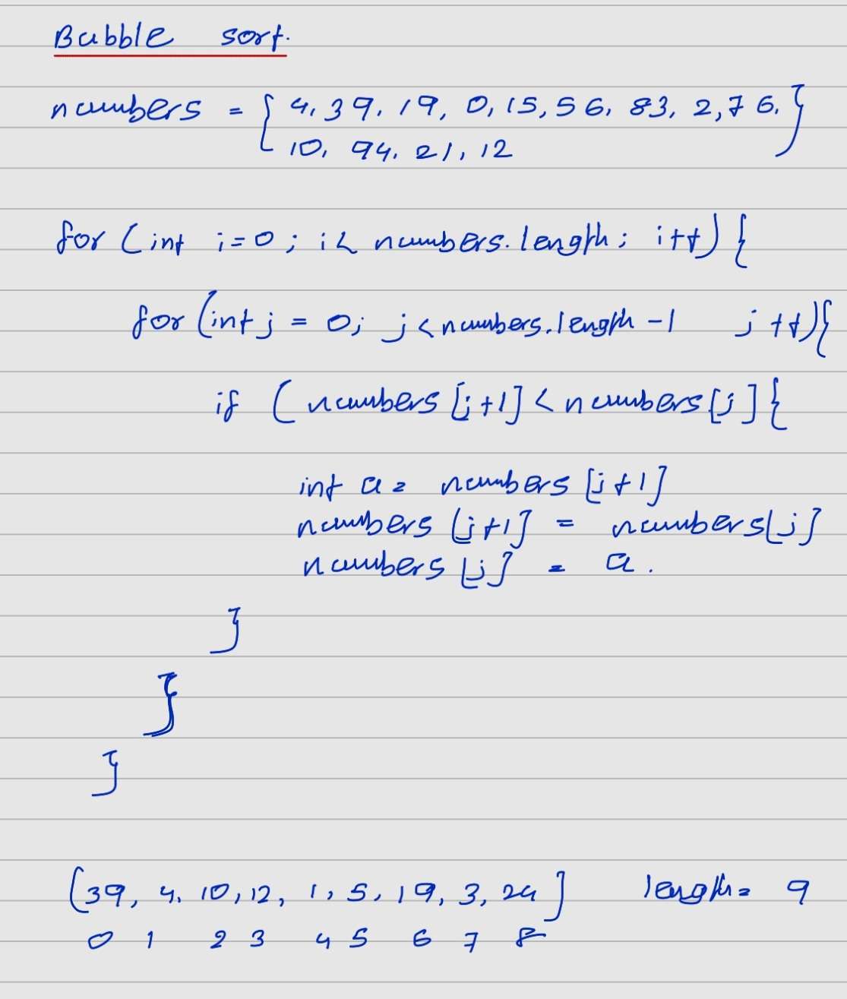
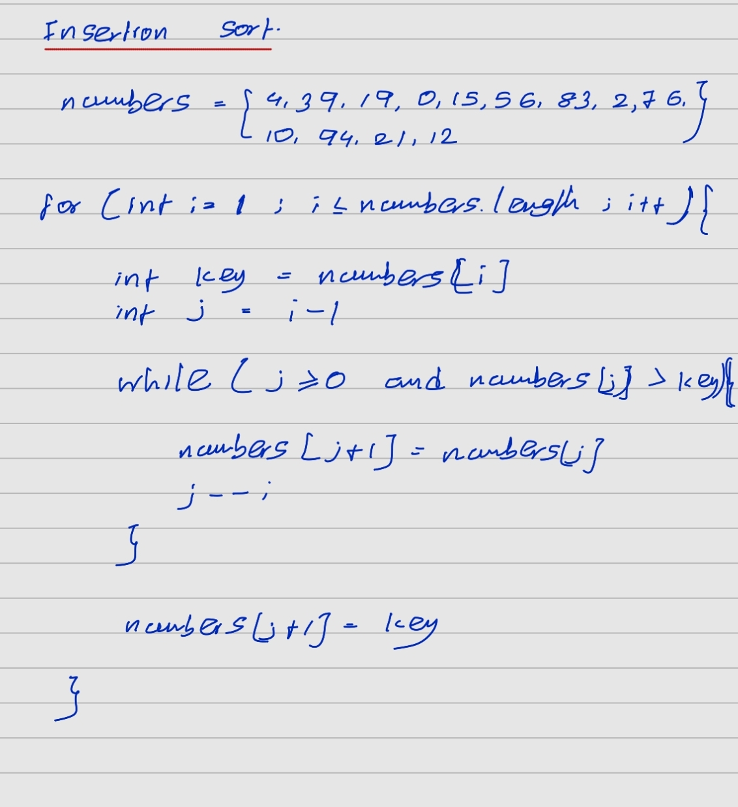

### 🫧 Bubble Sort Algorithm

**Bubble Sort** is a simple yet intuitive sorting algorithm that repeatedly steps through the list, compares adjacent elements, and swaps them if they are in the wrong order. This process continues until the entire list is sorted.

Just like bubbles rising to the surface, the largest elements "bubble up" to their correct position at the end of the array with each pass. With every iteration, the algorithm pushes the next-largest unsorted value to its final sorted location, reducing the range of comparison gradually.

#### 🔁 How It Works:

1. Start at the beginning of the array.
2. Compare the current element with the next one.
3. If the current element is greater, swap them.
4. Repeat for all elements, moving the largest to the end.
5. Perform this process repeatedly, excluding the last sorted elements each time.

#### 📦 Time and Space Complexity:

| Case    | Time Complexity    |
| ------- | ------------------ |
| Best    | O(n) _(optimized)_ |
| Average | O(n²)              |
| Worst   | O(n²)              |

- **Space Complexity:** O(1) – In-place sorting, no additional memory required.

#### ✅ Key Characteristics:

- **Stable sort** – maintains the relative order of equal elements.
- **In-place algorithm** – does not require extra memory.
- **Easy to implement** – great for teaching and small datasets.

---

### 🧩 Insertion Sort Algorithm – A Simple Yet Smart Sort

**Insertion Sort** is a straightforward and efficient sorting algorithm, particularly well-suited for small or nearly sorted datasets. It builds the final sorted array one element at a time, much like how people sort playing cards in their hands.

The algorithm works by taking each element and **inserting** it into its correct position in a previously sorted portion of the array.

#### 🛠️ How It Works:

1. Start from the second element (index 1), assuming the first is already sorted.
2. Compare the current element with the ones before it.
3. Shift all larger elements one position to the right.
4. Insert the current element into its correct position.
5. Repeat until the entire array is sorted.

#### 📦 Time and Space Complexity:

| Case    | Time Complexity              |
| ------- | ---------------------------- |
| Best    | O(n) _(nearly sorted input)_ |
| Average | O(n²)                        |
| Worst   | O(n²)                        |

- **Space Complexity:** O(1) – Performs sorting in-place.

#### ✅ Key Characteristics:

- **Stable sort** – retains the order of equal elements.
- **In-place** – requires no additional memory.
- **Efficient for small or partially sorted datasets.**

---

🔹 _Insertion Sort shines in scenarios where the array is already mostly sorted. While not the fastest on large datasets, it’s easy to implement and understand, making it a great choice for learning fundamental sorting logic._

